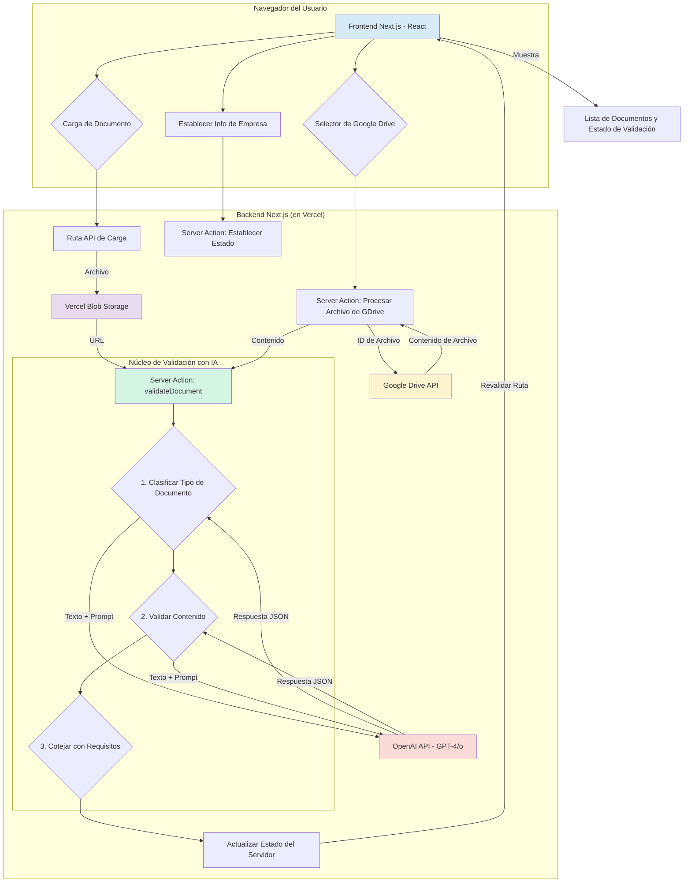

# "Mesa de Entrada" - Portal de Validación de Documentos con IA

[]()
[]()
[]()
[]()
[]()

"Mesa de Entrada" es un portal inteligente para la presentación y validación de documentos, diseñado para instituciones financieras. Automatiza el proceso de recolección y verificación de los documentos financieros requeridos a las empresas que solicitan créditos u otros productos.

La aplicación utiliza un sofisticado backend de IA para analizar el contenido de los documentos presentados en tiempo real, asegurando que cumplan con complejas reglas de negocio y requisitos. Esto reemplaza un proceso tradicionalmente lento y manual con un flujo de trabajo eficiente e impulsado por IA.

## Características Principales

- **Lista de Requisitos Dinámica**: Genera automáticamente una lista de los documentos requeridos basándose en el tipo de empresa del solicitante y sus necesidades financieras.
- **Análisis de Documentos con IA**: Utiliza los modelos de lenguaje grandes de OpenAI para:
  - Clasificar los documentos presentados (p. ej., Balance General, Estado de Flujo de Efectivo).
  - Extraer información clave y realizar validaciones basadas en el contenido.
  - Verificar estados financieros (p. ej., comprobando que `Activos = Pasivos + Patrimonio`).
  - Asegurar que se cumplan los requisitos específicos de cada documento (p. ej., la presencia de la opinión de un auditor).
- **Doble Opción de Carga**: Los usuarios pueden cargar documentos directamente desde su máquina local o seleccionarlos desde su Google Drive.
- **Feedback de Validación en Tiempo Real**: Proporciona retroalimentación inmediata sobre la validez de los documentos, con mensajes de error claros y un seguimiento del estado general.
- **Autenticación Segura**: Utiliza NextAuth.js con un proveedor de Google para una autenticación de usuario segura y la integración con Google Drive.
- **Stack Tecnológico Moderno**: Construido con Next.js 15, React 19, TypeScript y Tailwind CSS para una aplicación de alto rendimiento y fácil de mantener.

## Cómo Funciona

La aplicación guía al usuario a través de la presentación y validación de sus documentos financieros. El backend procesa estos documentos usando IA para asegurar que sean correctos y estén completos.



## Stack Tecnológico

- **Framework**: [Next.js](https://nextjs.org/)
- **Lenguaje**: [TypeScript](https://www.typescriptlang.org/)
- **UI**: [React](https://react.dev/), [Tailwind CSS](https://tailwindcss.com/), [shadcn/ui](https://ui.shadcn.com/)
- **IA**: [OpenAI API](https://openai.com/blog/openai-api)
- **Autenticación**: [NextAuth.js](https://next-auth.js.org/) (Proveedor de Google)
- **Almacenamiento de Archivos**: [Vercel Blob](https://vercel.com/storage/blob)
- **APIs Externas**: [Google Drive API](https://developers.google.com/drive)
- **Formularios**: [React Hook Form](https://react-hook-form.com/), [Zod](https://zod.dev/)

## Cómo Empezar

Sigue estos pasos para ejecutar el proyecto localmente.

### Prerrequisitos

- Node.js (v18 o posterior)
- `pnpm` (o `npm`/`yarn`)

### 1. Clona el Repositorio

```bash
git clone https://github.com/tu-usuario/document-validator.git
cd document-validator
```

### 2. Instala las Dependencias

Este proyecto usa `pnpm`.

```bash
pnpm install
```

### 3. Configura las Variables de Entorno

Crea un archivo `.env.local` en la raíz del proyecto copiando el archivo de ejemplo:

```bash
cp .env.example .env.local
```

Ahora, completa los valores requeridos en `.env.local`:

```
# Clave de API de OpenAI
# Obtenla de https://platform.openai.com/api-keys
OPENAI_API_KEY=tu_clave_de_api_de_openai

# OAuth de Google para NextAuth y la API de Google Drive
# Obtenlos de https://console.cloud.google.com/apis/credentials
GOOGLE_CLIENT_ID=tu_client_id_de_google
GOOGLE_CLIENT_SECRET=tu_client_secret_de_google

# Secreto de NextAuth
# Genera uno en https://generate-secret.vercel.app/32
NEXTAUTH_SECRET=una_cadena_muy_secreta
NEXTAUTH_URL=http://localhost:3000

# Token de Vercel Blob Storage
# Obtenlo del panel de tu proyecto en Vercel
BLOB_READ_WRITE_TOKEN=tu_token_de_lectura_escritura_de_blob
```

### 4. Detalles de Configuración

- **Google Cloud Console**:
  1. Crea un nuevo proyecto.
  2. Habilita la **API de Google Drive**.
  3. Ve a `APIs y Servicios` > `Credenciales` y crea **ID de cliente de OAuth 2.0**.
  4. Establece `Orígenes de JavaScript autorizados` en `http://localhost:3000`.
  5. Establece `URIs de redireccionamiento autorizados` en `http://localhost:3000/api/auth/callback/google`.
  6. Usa el Client ID y el Client Secret generados para tus variables de entorno.

- **Vercel Blob**:
  1. Crea un almacén de Blob desde el panel de tu proyecto en Vercel.
  2. Copia el `BLOB_READ_WRITE_TOKEN` en tu archivo `.env.local`.

### 5. Ejecuta el Servidor de Desarrollo

```bash
pnpm dev
```

Abre [http://localhost:3000](http://localhost:3000) en tu navegador para ver la aplicación.
